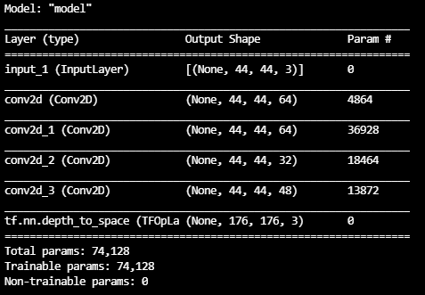
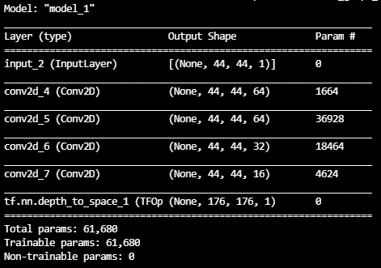

Super Resolution
=========================
초해상화
-------------------------
#### : 저해상도 이미지를 고해상도로 복원하는 과정

> [출처 유튜브 링크 - 빵형의 개발도상국 채널](https://www.youtube.com/watch?v=VxRCku4Bkgg)
 
[이미지 링크 - Dataset - CelebA](https://www.kaggle.com/jessicali9530/celeba-dataset)

DataGenerator.py를 이용해 각각의 data set을 (input, output)의 형태로 저장
 
CNN의 결과인 (44, 44, 4, 4, 3) 크기의 이미지를 Subpixel.py를 이용해 (176, 176, 3)으로 재배치

 
Subpixel.py 사용시 버전 문제로 에러가 발생하여 Subpixel.py를 사용하지 않는 대신
 tf.nn.depth_to_space()를 사용
 모델 학습 시 RGB 컬러 이미지 학습과 YUV 컬러 이미지 학습의 차이를 구분하기 위해 DataGenerator.py와 닮은 YUVDataGenerator.py를 생성
  이는 DataGenerator.py와 똑같지만 __data_generation() 시 이미지를 YUV화 하여 Y값만 저장
  따라서 (44, 44, 3) -> (176, 176, 3)의 과정을 거치는 모델과
 (44, 44, 3) -> (44, 44, 1) -> (176, 176, 1) ->(176, 176, 3) 모델을 사용
   traimodel.py에서 모델을 만드는 craeate_model_form_rgb/yuv() 함수와 upscale_image()함수는 

[Image Super-Resolution using an Efficient Sub-Pixel CNN](https://keras.io/examples/vision/super_resolution_sub_pixel/#build-a-model)
에서 인용하였다.

  만들어진 모델은 다음과 같다.
|RGB|YUV|
|---|---|
|||

  

| RGB 모델 학습 결과 | YUV 모델 학습 결과 |
|---|---|
|  |  |
- input: 저해상도 이미지
- resized: 단순 해상도 확장 이미지
- output: 학습된 모델로 초해상화 한 이미지
- groundtruth: 고해상도 이미지

